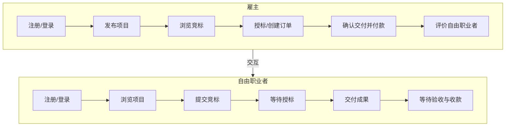
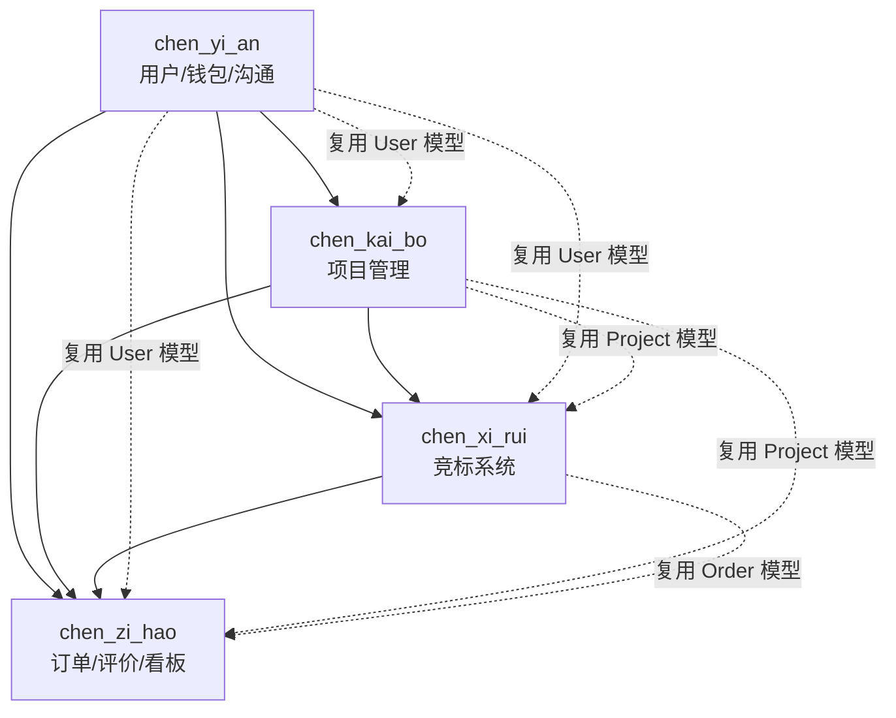

# Freelite — 自由职业项目竞标平台

## 目录结构

```
Free/
├── chen_yi_an/        # 陈怡安 — 用户系统/钱包/交付沟通
├── chen_kai_bo/       # 陈凯博 — 项目发布/浏览/管理
├── chen_xi_rui/       # 陈僖睿 — 竞标提交/授标
├── chen_zi_hao/       # 陈子豪 — 订单/评价/数据看板
├── freelite/          # 整合版（含所有模块）
├── docs/
│   └── database.sql   # 数据库建表+测试数据
└── README.md
```

## 业务流程图



## 系统架构图

```mermaid
flowchart LR
    subgraph 前端[前端 JSP + Bootstrap 5]
        U[用户页面]
        P[项目页面]
        B[竞标页面]
        O[订单页面]
        D[数据看板]
    end

    subgraph 后端[后端 Java Servlet + JDBC]
        S[Servlet 控制器]
        DAO[DAO 数据访问层]
        M[Model 模型层]
    end

    subgraph 数据库[(MySQL)]
        DB[(freelite 数据库<br/>10张表)]
    end

    前端 --> S
    S --> DAO
    DAO --> DB

    style 前端 fill:#e8f5e9,stroke:#4caf50
    style 后端 fill:#e3f2fd,stroke:#2196f3
    style 数据库 fill:#fce4ec,stroke:#f44336
```

## 模块依赖关系



## 项目结构

本项目为课程设计独立项目版本，每个组员一个独立的 Eclipse 项目，包名为各自姓名拼音。另有整合版 `freelite/` 包含所有模块，按姓名分包，可直接部署运行。

### 四个独立项目

| 目录 | 姓名 | 模块 | 运行URL |
|------|------|------|---------|
| `chen_yi_an/` | 陈怡安 | 用户注册/登录/资料编辑、钱包/充值、交付与沟通 | http://localhost:8080/chen_yi_an |
| `chen_kai_bo/` | 陈凯博 | 项目发布/列表/详情/编辑/删除/状态管理/搜索 | http://localhost:8080/chen_kai_bo |
| `chen_xi_rui/` | 陈僖睿 | 竞标提交/竞标列表/授标/我的竞标 | http://localhost:8080/chen_xi_rui |
| `chen_zi_hao/` | 陈子豪 | 订单列表/详情/完成确认、评价、数据看板 | http://localhost:8080/chen_zi_hao |

### 数据库

执行 `docs/database.sql` 创建数据库和测试数据。

SQL 文件包含所有表结构和测试数据（3个用户、3个项目）。

### 环境要求

- JDK 11+
- Apache Tomcat 8.5+
- MySQL 5.7+
- Eclipse 2026-03（或任意支持 Dynamic Web Project 的 IDE）

### 导入步骤

1. 每个独立项目单独导入 Eclipse：File → Import → General → Existing Projects into Workspace
2. 确保 Eclipse 已配置 Tomcat Server
3. 执行 `docs/database.sql` 创建数据库
4. 修改每个项目 `src/com/freelite/util/DBUtil.java` 中的数据库密码
5. 右键项目 → Run As → Run on Server

### 整合版（演示推荐）

| 目录 | 说明 | 运行URL |
|------|------|---------|
| `freelite/` | 所有模块整合为一个项目，含完整业务流程 | http://localhost:8080/freelite |

整合版包含所有模块代码，按姓名拼音分包（`chen_yi_an.*`、`chen_kai_bo.*`、`chen_xi_rui.*`、`chen_zi_hao.*`），导入步骤与独立项目相同。

### 说明

- 每个独立项目可以独立运行
- 整合版推荐用于完整流程演示
- 演示时需要手动模拟用户身份（使用 session 中的 user 对象）
